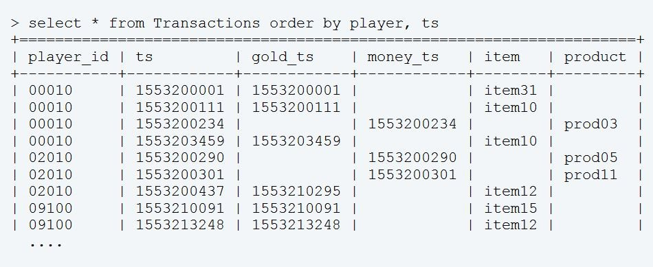
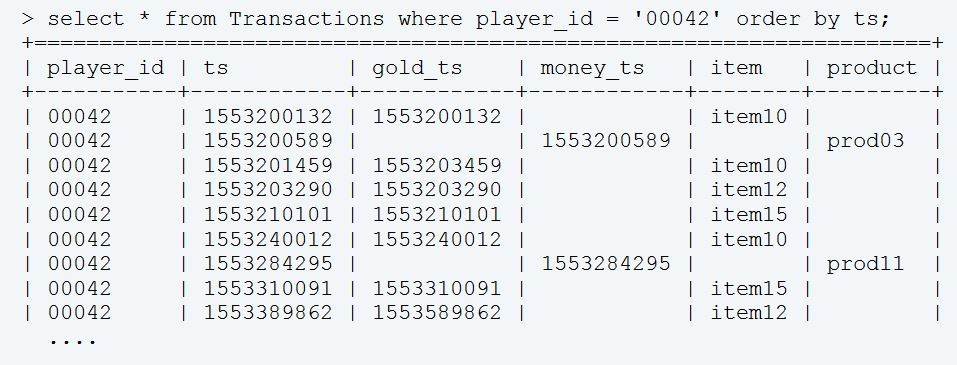
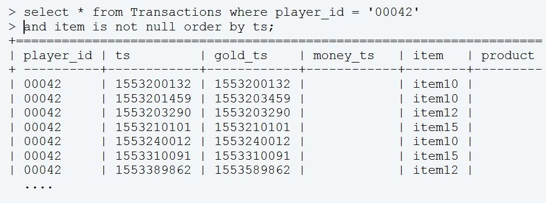
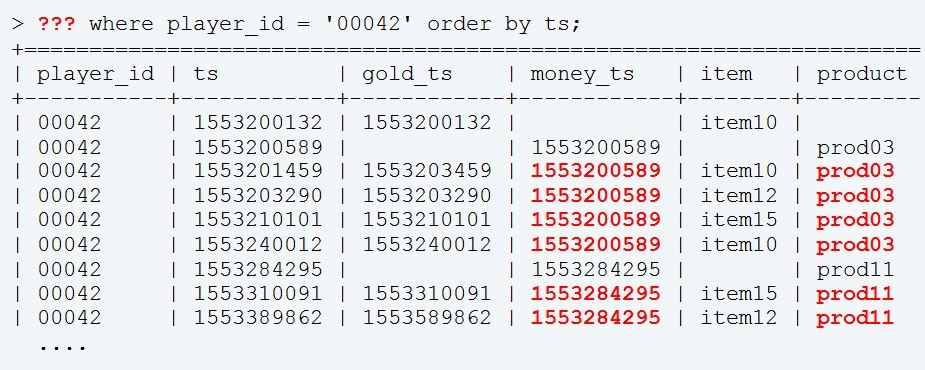

# Case 1: Rolling ~~Joints~~ JOINS (or how to find preceding and following events of a different type)


<div style="display: flex; justify-content: center;">

</div>

<p></p>


The SQL aggregate functions such as `avg()`, `sum()`, `count()` are common in accomplishing many typical tasks data analysts face in their daily job.  I also often use the window functions because of their power and flexibility. This series of posts describe a few real world problems where window functions offer distinct advantage over their classical counterparts.  This post is about rolling joins of two data sets.

To put it rather vaguely, a **rolling join** is a join of two user generated sets of timestamped event records that allows "carrying forward the latest" or "rolling back the earliest" observation of one set to be juxtaposed with the time ordered events of another. This concept is well illustrated in the context of R package `data.table` by Robert Norberg in his post [Understanding data.table Rolling Joins](https://r-norberg.blogspot.com/2016/06/understanding-datatable-rolling-joins.html). Assume we work on a freemium game economy and need to analyze two transactional tables, one for the virtual currency (say, gold) and the second for the real money purchases. Let's call them `economy_transactions` and `iap_transactions` respectively. The abbreviation IAP stands for “In App Purchase,” or [Microtransaction](https://en.wikipedia.org/wiki/Microtransaction), a standard term in mobile apps world. In a typical game, gold quantities are obtained ether through the game play or sold directly in microtransactions for real money (or both). In turn, gold can be spent on virtual goods, in-game items designed to enhance players' experience. For the sake of this post, it suffices to assume the following structures of these tables.

```
economy_transactions
=======================================================
player_id   | timestamp_utc  | item 
=======================================================

iap_transactions
=======================================================
player_id   | timestamp_utc  | product 
=======================================================

```
Here *item* and *product* fields hold names of virtual goods purchased with gold or real money. For brevity, I will use UNIX timestamps for time, although many databases nowadays support timestamps with millisecond precision.

Typical questions raised by game developers and producers in this context evolve around aggregate numbers, e.g.(daily, weekly, monthly) revenue, volume of gold sunk into the economy, most popular virtual goods, classification of customers according to the amount of money they spent including monitoring changes in their behaviors over time, etc. These questions are typically answered with the help of SQL aggregate functions, independently and separately for each type of economy transactions. 

More involved questions may concern time between transactions, players’ preferences for different items and products, time to the first purchase, most common transactions size and frequency, players’ responses to in-game sales and promotions. Answering these questions often leads to the customer segmentation initiative with the goal to discover players categories characterized by common patterns of purchasing behaviors: players with rare but large monetary transactions vs. players with many small purchases, sales junkies, regular spenders, single product lovers, etc.

In some cases questions related to the sequences of both types of events mixed together arise. For example, how many gold transactions are made between two real money purchases on average? Are players hoarding the gold spending it deliberately to maximize its value? What kind of money purchases are immediately followed by spending the newly obtained gold and what in-game items are bought in these transactions? The last questions are interesting for they reveal preferences of [impulse purchasers](https://en.wikipedia.org/wiki/Impulse_purchase) supposedly acting on a whim. Analyses of purchasing and spending patterns allows developers adjust players’ experience accordingly by delivering them the right offer at the right time. 

By utilizing SQL windows functions these questions can be answered. However, some preparatory work needs to be done first.

As each type of transaction is stored in its own table, the natural way to merge them into a single data set suitable for analysis is a join on *player_id*. Note that all records in both tables have to be included to cover cases of players with only one type of transactions, gold or money. It means the full outer join. Every time I need this type of join, I prefer to do some extra work figuring out what fields I really want and utilize *union* instead. Call it a matter of habit. Below the standard SQL clauses *with* and *union* create the main data set *Transactions*

```sql
with Gold as ( 
   select player_id
        , timestamp_utc as ts
        , timestamp_utc as gold_ts 
        , null          as money_ts
        , item
        , null          as product
     from economy_transactions
), Money as ( 
   select player_id
        , timestamp_utc as ts
        , null          as gold_ts 
        , timestamp_utc as money_ts
        , null          as item
        , product
     from economy_transactions
), Transactions as (
   select * from Gold
    union
   select * from Money
)
```


With these preparations in place, the query `select * from Transactions` returns players’ transactions history sorted by the timestamp that may looks like shown below (remember, all timestamps are in UNIX time):

<p>

</p>


Player 00010 made two gold purchases buying in-game items item31 and item10 before making a real money purchase of prod03 followed by another gold transaction acquiring item10 for the second time. Player 02010 spends real money in in a pair of microtransactions for prod05 and prod11 and then immediately sinks her gold into item12. Player 09100 did not spent any real money yet, but acquired two in-game items, item15 and item12. 

The question of impulse purchases can now be reformulated as searching for in-game economy items funded by an immediately preceding money transactions. As each player’s records are independent of records of others, in what follows I focus on a single player’s history. 

<p>

</p>

All gold transactions can be easily selected by the simple query, however all information on money transactions will be lost

<p>

</p>


It is now clear that the empty fields in the shown result set need to be populated with the data derived from the preceding money transactions. Then the problem would be solved. In other word, I want construct a query returning


<p>

</p>

Highlighted data are the result of “rolling forward” IAP transactions to the subsequent records of gold transactions. This operation is the gist of rolling join of Gold and Money data sets. To achieve this effect in SQL I use window function last_value() over a cumulative frame of each player’s partition. 

```sql
with Gold as (
   ...

), Transactions as (
   select * from Gold
    union
   select * from Money
), RJoin as (
   select player_id
        , ts
        , gold_ts
        , last_value(money_ts) ignore nulls 
                over (partition by player_id
                          order by ts 
                           rows between unbounded preceding 
                                    and current row) as money_ts
        , item
        , last_value(product) ignore nulls 
                over (partition by player_id
                          order by ts 
                           rows between unbounded preceding 
                                    and current row) as product
     from Transactions
)
select * from RJoin order by player_id, ts
```

This use of `last_value()` requires some explanation. First, the data set *Transactions* is split into multiple partitions, one partition for each value of *player_id*, and records within each partition are sorted by the timestamp ts. Next, for each row of each partition a frame is created spanning from the first row of the partition up to and including the current row (recall that each partition is ordered so that the first, last etc. rows are well defined). In effect, each row has "attached" a copy of the partition it belongs to truncated at the row itself. The frame of the first row consists of a single record, a copy of the row itself, the frame of second row has two records, (copies of) the first and second records, the frame of third row is the set of first, second and third records, etc. However, not all the columns of these frames are required, only *money_ts* and *product* are needed. These columns are specified as arguments of two calls to `last_value()`. This function returns the last value of its argument observed within a partition. It will return values of *money_ts* and *product* of the current row. However, the modifier `ignore nulls` makes this function, well, ignore nulls in its argument and return last non-null values of *money_ts* and *product* found within each player partition. This gives us the desired result, i.e. the details of the last valid money transaction preceding each gold transaction records within each player’s history, replicating the example given for player 00042 above.

Now the question of impulse purchases is tractable, i.e. where do players spend their gold after purchasing it in a IAP transaction? To make it more concrete, let’s set up a maximum time elapsed between money and gold transactions to 5 minutes. Then the query 

```sql
with Gold as ( 
   ...
), Money as ( 
   ...
), Transactions as (
   ...
), RJoin as (
   ...
)
select product, item, count(*) frequency
  from RJoin 
 where gold_ts - money_ts between 0 and 5*60 -- 5 minutes
 group by product, item
 order by 3 desc
 ```

returns the list of product-item pairs sorted by the frequency of their occurrences. In addition to the typical "Top 10" answer, this data set can be seen as a contingency table, allowing application of statistical techniques such as [Correspondence Analysis](https://en.wikipedia.org/wiki/Correspondence_analysis) to uncover more detailed relationships between monetary and gold economies. 

Another question that can be easily answered is the count of gold transactions that follow a real money one.

```sql
  ...
)
select player_id, count(*) gold_tx
  from RJoin 
 where item is not null 
   and money_ts is not null
 group by money_ts
 ```

Subsequent averaging of *gold_tx* computes the average count of gold transactions across all players.

Finally, similar approach based on the function `first_value()` allows one to "look forward" and retrieve the first occurrence of an event of interest from the sequence of events triggered by an event of another type. For instance, in the above setting the question can be formulated as 'how much time elapses between a real money purchase and subsequent purchasing of a specific in-game item with gold?' addressing the question of in-game hoarders. Another version of the same question in the context of game progression is 'how much time elapses between ranking up and unlocking a specific reward?' This assumes that rank-ups and unlocks events are stored in two different timestamped tables.


<p align='right'>
<i>April, 2019</i>
</p>


