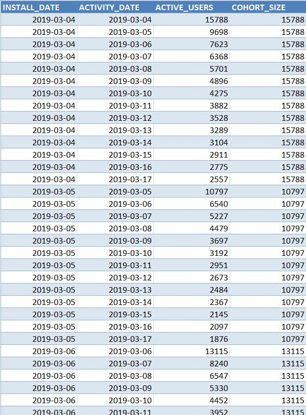
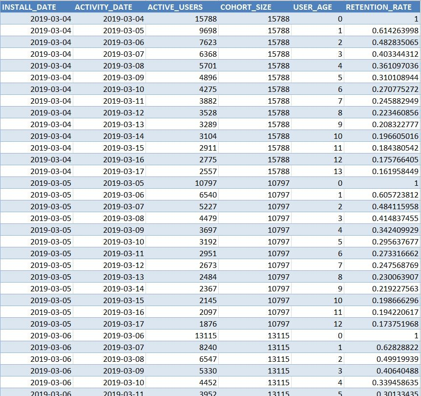
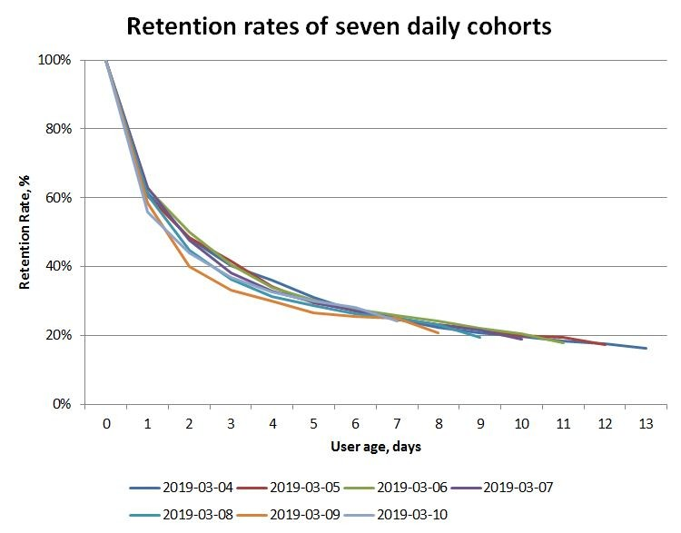
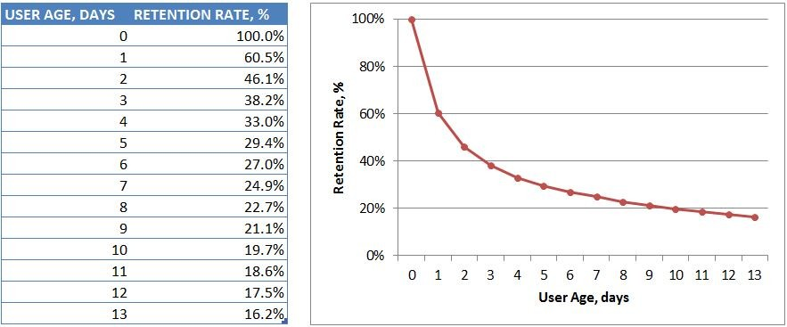
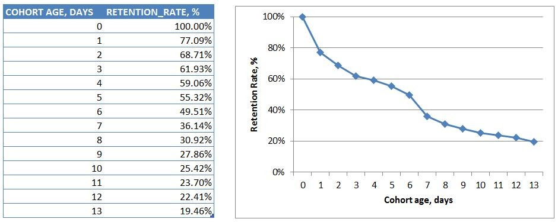
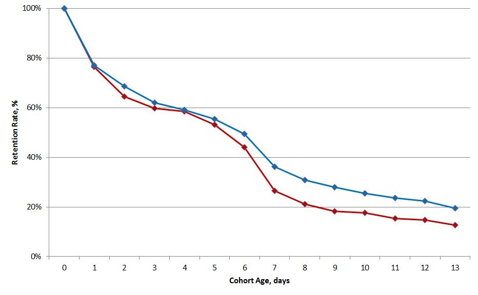
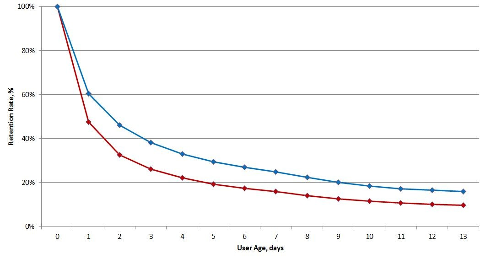

# Case 2: Daily retention of multi-day cohorts or working with two differently grained temporal metrics


<div style="display: flex; justify-content: center;">
    
</div>

<p>
</p>

User retention is one of the most important metrics for many types of business, be it customer retention in retail industry, or magazine subscriber retention, or player retention in video games, or client retention in consulting businesses. It is typically defined for a cohort of users acquired during a period of time and measured as Retention Rate, or more accurately, Return Rate defined as the ratio of users active at a given date over the size of the cohort ([the percentage of your users who return to your app on a given day](https://developer.yahoo.com/flurry/docs/analytics/lexicon/returnrate/)). It is a function of user "age," i.e. the time passed between the date retention is computed for and the date when the user/customer was acquired.


## Base definition

The common practice for mobile and video games, as well as mobile apps, is to monitor daily retention rate of players acquired on the same calendar day (daily cohorts).
The computations are rather straightforward. Given the user sessions table 
the retention rate can be concisely expressed via a single SQL query.
Assume for simplicity that we are dealing with seven cohorts of users whose first sessions took place during the week March 4, 2019 - March 10, 2019.  We are interested in their activity up to March 17, 2019, i.e. for at least one week. Let's also define the time of first sessions as the app install time.

```sql
-- PostgreSQL syntax
create table user_sessions (
    user_id varchar,
    session_time timestamp, 
    ...
)
...

with P as (
    select user_id, 
           session_time::date as activity_date,
           min(session_time::date) over (partition by user_id) as install_date
     from user_sessions
), C as (
    select install_date, 
           activity_date,
           count(distinct user_id) as active_users,
           case when install_date = activity_date 
                then count(distinct user_id) 
                else null
            end as cohort_size
     from P
    where install_date  between date '2019-03-04' and date '2019-03-10'
      and activity_date between date '2019-03-04' and date '2019-03-17'  
    group by install_date, activity_date  
), T as (
    select install_date, 
           activity_date, 
           active_users, 
           first_value(cohort_size) ignore nulls over (partition by install_date order by activity_date) as cohort_size
     from C
)
select * from T 
 order by install_date, activity_date
```


* The subquery *P* returns all records from *user_sessions* table with the user identifier *user_id* and session timestamps truncated to the calendar day. This field is called *activity_date*. The third column *install_date* holds the date of the first user session. Note that this query returns a large data set of the whole session history of the app and is used here for illustration purposes only. In the real life scenario it should be rewritten to return only users who installed the app between March 4, 2019 - March 10, 2019.
* For each value of *activity_date*, the subquery *C* computes the count of users who were active, ``count(distinct user_id)``, and the size of daily cohort formed at that date
* Finally, in *T* the cohort size is rolled forward populating each row with the value or records satisfying ``install_date = activity_date``


The resulting data set may look something like this


<div style="display: flex; justify-content: center;">

</div>

<p>
</p>


The retention rate is easily computed for each cohort and each activity date as the ratio ``active_users/cohort_size``. 
At the same time the cohort "age" is calculated as the time difference between activity date and install date.
With the subquery *T* defined above,  
```sql
...
, R as (
    select install_date, 
           activity_date, 
           active_users, 
           cohort_size, 
           datediff(day, install_date, activity_date) as user_age,
           active_users::float/cohort_size::float as retention_rate
      from T     
)
select * from R
order by install_date, activity_date
```


<div style="display: flex; justify-content: center;">

</div>

<p>
</p>


Note that this calculation is not entirely accurate because of rounding errors introduced by the date arithmetic of SQL. If we had carried out *install_time* and *session_time* from subquery *P*, more precise version can be obtained with the more accurate statement
`floor(datediff(second, install_time, session_time)::float/86400.0) `

Finally, plotting retention rates against user age gives us the so called retention curves or retention profiles of the seven daily cohorts.


<div style="display: flex; justify-content: center;">

</div>

<p>
</p>


Let's consider now the situation when we need to summarize these seven curves, as would be in the case of some sort of campaign running for a week. In short, we need to merge these seven lines into a single retention curve. The most natural way to do so is to compute the average rate over all user ages with the query


```sql
...
, R as (
    ...
)
select user_age, mean(retention_rate) as retention_rate
  from R
 group by user_age
 order by user_age
```


This yields the following result:


<div style="display: flex; justify-content: center;">

</div>


<p>
</p>


## Discussion and alternative approach


Although useful and commonly used, the described methods of averaging may not be entirely satisfactory. In situations of user acquisition campaigns spanning a few days (say, a week), or A/B tests concerning retention of new users and running for several days, the averages have certain disadvantages. Breaking down the multi-day cohort into daily sub-cohorts smoothes the data and hides day-by-day differences between individual acquisition days. Another disadvantage is the constantly changing results - each new day adds players to all age groups requiring recalculation of all the numbers. This makes the average retention computed so far change as the tomorrow's data become available. This complication is rooted in the choice of user age as an independent variable. Finally, in the scenario of A/B tests early insights are highly valuable as the experimental settings may badly affect the user experience and calling for the early test cancellation. The averaging method requires enough data collected before the informative conclusions can be made. In the example above, two weeks need to pass since the start of the experiment to produce the charts shown. It would be better if the data computed today would not change tomorrow when the new daily cohort joins.

Luckily, there exists another way to compute retention of a multi-day cohort of new users. The main idea consists of looking at the cohort as it is being formed over time. The time variable in this approach is not the player age but the age of the cohort itself, that is, the count of days since the cohort inception day. On the first day of cohort formation, the retention rate is obviously 100%. On the second day. the count of active users are the count of those who were active on this day of the cohort existence. This number includes users acquired on the day two plus users acquired on the first day who came back on the second day. For the third day, active users are those who are acquired on day three (assuming the cohort is still being formed) plus users acquired on the first two days who returned on the day three. And so on.

At the same time, the size of the cohort grows every day as the acquisition process continues. The retention rate for day X therefore is the ratio of active users on day X divided by the cohort size at day X. Once the cohort formation is complete, the formula does not change. For each date it is the ratio of active users over the full cohort size as measured on the same day. After the completion date the cohort size does not change; the denominator is a constant.

Implementation of these calculations in SQL relies on window functions again. 

```sql
with P as (
    select user_id, 
           session_time::date as activity_date,
           min(session_time::date) over (partition by user_id) as install_date
     from user_sessions
), C as (
    select install_date, 
           activity_date,
           count(distinct user_id)  
             over (partition by datediff(day, date '2019-02-04', activity_date) ) as active_users,
           case when install_date = activity_date 
                then user_id
                else null
            end as user_install
     from P
    where install_date  between date '2019-03-04' and date '2019-03-10'
      and activity_date between date '2019-03-04' and date '2019-03-17'   
),  D as (
    select activity_date, 
           active_users,
           count(distinct user_install) as daily_installs
     from C     
    group by activity_date, active_users
), S as (
    select activity_date, 
           active_users, 
           sum(daily_installs) over (order by activity_date) as cohort_size
     from D
)
select activity_date, 
       active_users::float/cohort_size::float as retenttion_rate  
     from S
 order by activity_date

```

The principal part of calculations is the subquery C. There is no aggregation by install and activity dates anymore. Instead, the query returns the count of active users by their activity calendar date and the *user_id* for users who were acquired on that date. Notice the use of `distinct` in calculations of active users. Since there is no partitioning by install date, the result is the count of all users who showed up at the day when the cohort was `datediff(day, date'2019-03-04', activity_date)` days old. This is the number we need for the numerator in the retention rate formula.

To obtain the denominator, we need to compute cohort size for each day of the cohort existence, i.e. for each value of *activity_date*. We do it in two steps. First, in D we compute daily installs, and then the subquery S returns the cumulative sum of these counts yielding the cohort size accumulated by the date *activity_date*. The final result is shown below.


<div style="display: flex; justify-content: center;">

</div>

<p>
</p>

The drop at `cohort age = 7 days` marks the end of cohort formation period. We see that he retention rate declines linearly after day `7`, similarly to the conventional retention rate discussed earlier. The difference, however, is essential as the x-axis is the age of the cohort, not the age of users.

As noted above, in this approach the historical data remains immutable allowing for quicker decisions during the cohort formation. This is particularly important in cases of risky A/B tests, say, prompt evaluation of acquisition channels.

In those situations where two or more cohorts are compared to each other, the query above requires certain modifications. The subquery *P* needs to return the user group identifier *group_name*, window functions in *C* and *S* require partitioning by *group_name*, and *group_name* has to be added to the `group by` clause of subquery *D*. An example for the two group test may look like this.  


<div style="display: flex; justify-content: center;">

</div>

<p>
</p>


The difference between two cohorts is clearly seen here, as well as the day when their retention rates began to separate significantly. After the cohorts completion date, that is, `day 7`, both groups demonstrate similar decay rate (the curves appear almost parallel for days `8-13`). This suggests that the differences in retention might have been caused by different user experience during the cohorts formation period, possibly attributable to accidental and uncontrolled external factors deserving further investigation.


<div style="display: flex; justify-content: center;">

</div>

<p>
</p>


Retention rates computed by averaging over user ages shown above hides these differences and does not reveal fine details. Except for the fact that the retention rate of one group is better than another, there is no additional information to be inferred from this chart.


<p align='right'>
May 2019
</p>