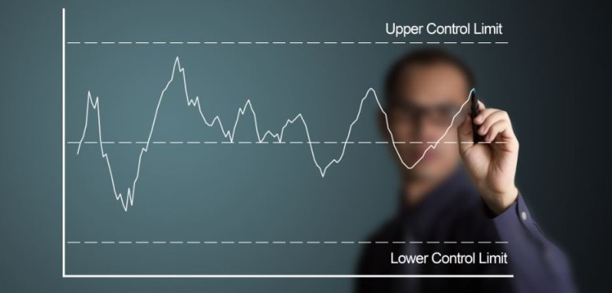

# Case 4: Chance or Change? Control charts as protection from overreaction

<i>Why are our numbers all the way down? What's happening?</i>

An important metric has dropped down. It's not another outage. It's not something we did. It's not the market falling off the cliff. What is it? After thorough investigation the analytics team concluded, there is no smoking gun to be found. So what was it? Probably, nothing. And now they face another challenge - how to explain to others that there is no reason to worry, it was just a fluke, random variation, routine fact in the life of metrics.

<table style="margin-left: auto; margin-right: auto;border-collapse:collapse;">
  <tr><td width="30%"></td>
    <td>After a presentation followed by prolonged discussion, a thoughtful executive asked, 'How do we know that what we see is a result of chance and not something caused by the change in our business? How is the team to respond to this question? Is there any way to convince ourselves and others that what appears to be a change in business is a result of a chance affecting the metrics? One possible route is the use of control charts.
    </td></tr>
</table>

## Control Charts
Almost a century ago, Walter Shewhart working at Bell Labs made a crucial observation by pointing out two types of variation in metrics generated by manufacturing processes. Some variation is expected and inevitable due to the nature of the process itself, and some variation is exceptional, outside the bounds of routine. The latter can be further interpreted as a signal of a process change. He created the technique of process-behavior charts known now as Shewhart's control charts that separate the total variation into these two components. Since then control charts gained wide recognition in the domain of industrial process control and formed a vast field of theoretical research in statistics. The individuals control chart described below explores variance components of individual measurements observed over time, arguably the most common case in life of every data analyst.

The individuals control chart begins as a time series chart. All observations are plotted against the time axis, and a horizontal central line is added as a visual reference. What make a time series chart a control chart are two horizontal lines indicating boundaries called Upper and Lower Control Limits (UCL, LCL).

Shewart W. Economic Control of Quality of Manufactured Product, 1931
Their values are computed from the data in such a way that for any observation located within the LCL-UCL band the observation's deviation from the central line is caused by chance. These observations represent routine intrinsic fluctuations around the center line; they are inevitable in every process. Their variation is understood as a result of common causes. Simply put, this variation is just an unavoidable part of normal functioning of the system (cf. the right chart on the picture above taken from Walter Shewhart's book "Economic Control of Quality of Manufactured Product" published in 1931). Observations falling outside the band (also called the control band) are not routine; their variation is attributed to special causes. They are exceptional, not caused by the process' nature and therefore suggest presence of a change in the process behavior. This is a signal of something unusual happening with the process. Furthermore, these observations must have assignable causes meaning that the observed variance can and should be explained by identifiable factors, internal or external.The initial "why" question in the subtitle of this article is an attempt to assign a cause to the observed variance. Based on results of their analysis, the analytics team's job is to convince others that there is no exceptional component in the variance attributable to a change, that is, all observed variance is due to chance. See Wikipedia page on common and special causes variations for further explanation of these terms. When the process stays withing its control limits over a period of time it's said to be in control. Observations falling outside the limits indicate the process out of control. There are more refined definitions of out of control processes developed within the Six sigma framework designed for the early identification of process' deviation from its controlled state.

Construction of control charts
The main factor of control charts' success in industrial settings is reliable detection of possible changes in the process' behavior. It all comes down to the accurate definitions of Upper and Lower Control Limits.

First, the ranges of routine variance need to be agreed upon on the basis of available historical data. When there is enough past information, the acceptable variance range can be defined as a confidence interval of the observed metric. This works well if the metric has a known and analytically tractable statistical distribution described by a set of parameters. Then the analytical derivation yields precise estimates for UCL and LCL. Under common circumstances, however, this assumption is rarely satisfied, which led to developments of many non-parametric techniques. One of them, devised for the so-called individual's control charts, is well explained in the book written by Donald J. Wheeler "Understanding variation: The Key to Managing Chaos", second edition published in 2000 (see also Wikipedia page Shewhart individuals control charts).

Given a time series of observations X, the first step is to compute the series of absolute values of differences between each pair of consecutive observations. This series is called the series of moving ranges and denoted mR. It directly measures the time-to-time variation of X. As a time series, mR also can be monitored for exceptional variation alongside X. All the values of mR are non-negative and the only control limit calculated for mR is the upper range limit (URL) given by the formula URL = 3.27 * average(mR). Then the UCL and LCL for X are computed as UCL/LCL = average(X) plus/minus 2.66 * average(mR). The control charts for X and mR combined together are called XmR chart of the process. Let's illustrate these calculations by an example of a certain metric collected for 83 weeks starting in September 2019.

> select * from weekly_stats;

WEEK      |METRIC |
----------|-------|
2019-09-02|2154.57|
2019-09-09|1985.91|
2019-09-16|1420.28|
2019-09-23|1586.47|
...
The following Snowflake SQL query computes all necessary components of both the control chart and the ranges control chart.

with config as ( 
   select date '2019-08-31' as calib_start
        , date '2019-11-20' as calib_end
), X_mR as ( 
  select week 
       , case when week between calib_start and calib_end 
              then 1 
              else null 
         end as calibration
       , metric as X
       , metric * calibration as calib_x
       , avg(calibration * metric) over () avg_X
       , abs(metric - (lag(metric) over (order by week))) as mR
       , mr * calibration as calib_mR
   from weekly_stats, config 
)
select X_mR.* 
     , avg(calibration * mR) over () avg_mR
     , 3.27 * avg_mR as url
     , 0.0           as lrl
     , avg_X - 2.66 * avg_mr as lcl
     , avg_X + 2.66 * avg_mr as ucl
     , case when X > ucl or X < lcl then X
            else null 
       end as X_alert
     , case when mR > url then mR 
            else null 
       end as mR_alert
  from X_mR
 order by week

Parsing it out:

week is the time variable, X - the metric
config - an alias for parameters calib_start and calib_end specifying the calibration period taken as a period of normal process functioning
X_mR subquery returns the metrics: week, calibration, X, calib_x, avg_X, mR, c_mR
calibration is a flag indicating if the week falls within the calibration period. Notice the use of 1 and null (not zero!). Here I rely on ANSI SQL standard for the aggregate functions handling null values.
calib_x - value of X for weeks inside the calibration period, null otherwise
avg_x - average of metric over the calibration period. This is the centered horizontal line of the control chart
mR - moving range computed using lag() function over all weeks
calib_mR - value of mR for weeks inside the calibration period, null otherwise
The main query returns all values from X_mR, performs calculations of upper and lower control limits for X and mR as well as the following metrics

avg_mR - average of mR over the calibration period. This is the centered horizontal line for the ranges control chart
X_alert - an indicator of X outside the control band
mR_alert - an indicator of mR outside the control band
First rows of the result display all measurements required to create the XmR control chart

Query output
and the chart itself with the calibration period of 10 weeks in 2019 marked in green.

No alt text provided for this image
There are eight instances of special cases when the process was out-of-control and three cases of anomalous process variance when the process metric increased or decreased too rapidly. These observations point out to a presence of factors, either internal to the process or external, or both, that call for an investigation aimed to identify assignable causes of anomalies occurred in February-March. Visual inspection also suggests a possibility of systemic changes in process behavior that took place in March. The process variance did not change substantially after the anomalous period in February-March but the process level seems to had lowered. This finding may indicate a need for the re-calibration and subsequent acceptance of the new norm.

Final notes
Apart from the curious spin on the"chance-change" business dichotomy, control charts are simple and informative tool of statistical process control widely used in the industrial quality control monitoring. A straightforward extension to the case of multivariate processes is the set of control charts created for each process' component metric. This approach, however, fails to detect anomalies in the covariance structure, i.e. in situations when the correlation between two or more variables falls out of the expected range while the variables themselves stay in-control. When the number of monitored metrics is high, tracking all of them and their pairwise correlations becomes impractical. One possible solution to this problem is based on the multidimensional version of the Student's t-statistics usually associated with the name of Harold Hotelling, see the Wikipedia entry on Hotelling's T-squared distribution. A very detailed and insightful explanation is provided in the book "Multivariate Statistical Process Control with Industrial Applications" by Robert L. Mason and John C. Young published in 1987. Similarly to cases when the Student's t-statistics is employed, the multivariate processes studied in this book are assumed to be (close to) the multivariate Normal. Non-normal processes, which are commonplace in the real life, are much more difficult to monitor. Numerous studies have been devoted to the development of control charts techniques free of any distributional assumptions imposed on the monitored process. A comprehensive state-of-the-art is given in the recently published books "Nonparametric Statistical Process Control" (2019) by S. Chakraborti and M. A. Graham and "Distribution-Free Methods for Statistical Process Monitoring and Control" (2020) edited by M. V. Koutars and I. S. Triantafyllou.

August 2020